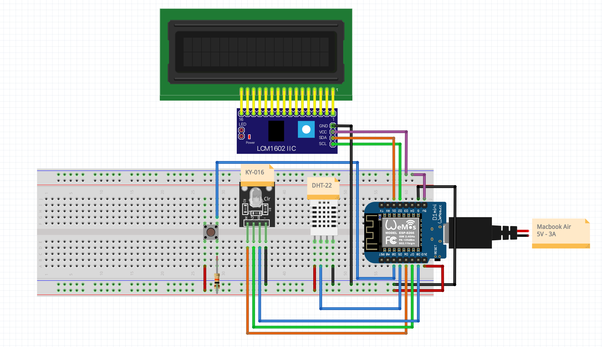

# Wiring Diagram

Below you will find the Wiring diagram for the embedded device, created in Fritzing.

# Bill of Materials (BOM)

| Part number | Manufacturer | Description               | Quantity | Price (incl VAT) | Subtotal (incl VAT) | Example URL |
|------------|--------------|---------------------------|----------|------------------|--------------------|------------|
| WMD1MINIV4    | Wemos | Wemos D1 Mini V4           | 1        | 4.95 EUR         | 4.95 EUR           | [Wemos D1 Mini V4](https://www.hobbyelectronica.nl/product/d1-mini-usb-c-v4/) |
| COM-KY016RGBLED    | Generic      | KY-16 RGB LED Module      | 1        | 1.79 EUR         | 2.79 EUR           | [KY-016 RGB](https://tecvoordeel.nl/product/rgb-led-module/) |
| C-DHT22  | DHT | DHT-22 Sensor | 1        | 5.50 EUR         | 5.50 EUR           | [DHT-22 Sensor](https://www.tinytronics.nl/shop/nl/sensoren/lucht/vochtigheid/dht22-thermometer-temperatuur-en-vochtigheids-sensor) |
| OT2021 | OTRONIC | I2C Backpack | 1        | 1.10 EUR         | 1.10 EUR           | [I2c backpack](https://www.otronic.nl/nl/lcd-1602-2004-i2c-adapter.html) |
| LCD1602 | OTRONIC | 1602 LCD Display | 1        | 2.36 EUR         | 2.36 EUR           | [1602 LCD](https://www.otronic.nl/nl/1602-lcd-groen-geel-met-backlight.html) |
| 101-TS6111T1601-EV| Generic | Tactile Button            | 1        | 0.06 EUR         | 0.06 EUR           | [Tactile button](https://www.hackerstore.nl/Artikel/177) |

