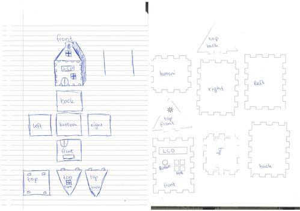

# Design

## Concept

### User and User Needs

At first i had chosen to make a star-wars themed weather station to appeal to the millions of star-wars fans around the world. However this concept showed to be a lot more complex to create then expected at first and didn't seem to work out the way i wanted it to. It was very hard to create a clear yoda character that would into eachtother without any glue. Due to these complications i chose to completely change my design.

Amsterdam, the city where i was born and where i have lived all my life. The city center has one thing that really stands out and is loved by most inhabitants of Amsterdam, the canal houses! These housed were built in the 17th century and where used for residences, storage units, and business during the dutch Golden Age. Nowadays these houses are some of the most expensive in the city meaning only the ultra rich can enjoy the design and heritage of the canal houses.
That's why i chose to create a weather station that resembles an Amsterdam canal house. This way anyone can own a small version of their favourite canal house at home.

### Goals of the Product

The goal of the product is to give everyone who loves the Amsterdam canal houses a chance to own their own one. This mini version is not only relevant due to the design that resembles the canal houses. A lot of the houses in Amsterdam, especially the older ones, don't have a reliable thermometer that gives the homeowners the information they need to be able to live in a comfortable temperature. That's why i chose to turn this mini canal house into a weather station. This weather station will give users the real-time temperature and humidity in their house. These values can be read out from a lcd screen by pressing a button. Next to the lcd screen the house will also have a led light which will give the user a color based on the temperature inside. This led light will change to red if it is too hot inside, green if the temperature is just right and blue when it's too cold inside.

### Requirements

In the below image you will see the requirements that i have set up for the physical design. The requirements contain some that are specific for the user that will use the product and some that are specific to the manufacturer of the product.

### Sketches

Below you will find the sketch i created to get an idea for how the product will look. In the sketch i decided to draw the overall look of the house aswell as how the laser cut should look to be able to fit the parts together. The front face of the house will hold the lcd screen and button to control the screen for energy saving purposes. The display itself will display the current temperature and humidity within the users home. The top front of the house will have a windowd which will hold a rgb led. This led will change color based on the temperature. The color of the led will indicate that the user may need to decrease or increase the temperature in their home. The top of the box itself will have 4 slots that will be used to attach the roof. The slots will have a width of 5mm, this is the same thickness as the wood i want to use for the product. The sketch also shows some details like the shield at the top of the house and the front door. These details will be engraved into the product to give a premium and detailed look to the house.

 In the paper prototype i printed out the dxf version of my design to get an idea for how all the parts will fit into eachtother. After printing and cutting out the design i realised that i needed to be more precise when creating the slots for the roof. After this i made some changes to my dxf design in Inkscape to make the parts fit into eachtother perfectly.

## Digital Manufacturing

### The Device

### The Material

### Techniques

## Digital Design

### Software

### Process