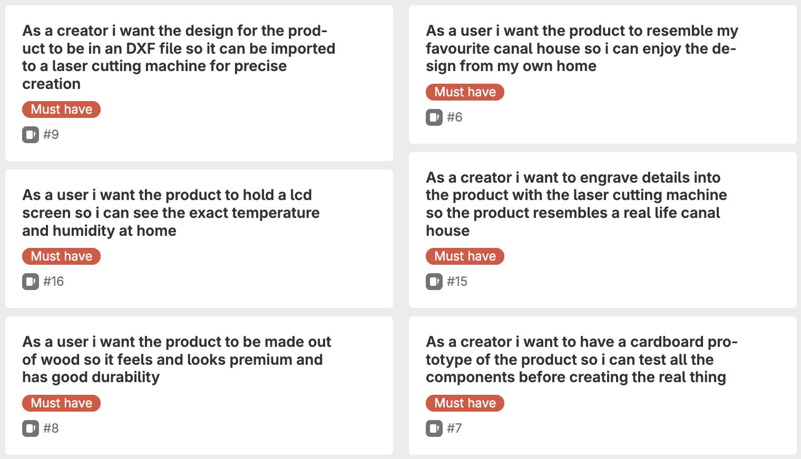

# Design

## Concept

### User and User Needs

At first i had chosen to make a star-wars themed weather station to appeal to the millions of star-wars fans around the world. However this concept showed to be a lot more complex to create then expected at first and didn't seem to work out the way i wanted it to. It was very hard to create a clear yoda character that would into eachtother without any glue. Due to these complications i chose to completely change my design.

Amsterdam, the city where i was born and where i have lived all my life. The city center has one thing that really stands out and is loved by most inhabitants of Amsterdam, the canal houses! These housed were built in the 17th century and where used for residences, storage units, and business during the dutch Golden Age. Nowadays these houses are some of the most expensive in the city meaning only the ultra rich can enjoy the design and heritage of the canal houses.
That's why i chose to create a weather station that resembles an Amsterdam canal house. This way anyone can own a small version of their favourite canal house at home.

### Goals of the Product

The goal of the product is to give everyone who loves the Amsterdam canal houses a chance to own their own one. This mini version is not only relevant due to the design that resembles the canal houses. A lot of the houses in Amsterdam, especially the older ones, don't have a reliable thermometer that gives the homeowners the information they need to be able to live in a comfortable temperature. That's why i chose to turn this mini canal house into a weather station. This weather station will give users the real-time temperature and humidity in their house. These values can be read out from a lcd screen by pressing a button. Next to the lcd screen the house will also have a led light which will give the user a color based on the temperature inside. This led light will change to red if it is too hot inside, green if the temperature is just right and blue when it's too cold inside.

### Requirements

In the below image you will see the requirements that i have set up for the physical design. The requirements contain some that are specific for the user that will use the product and some that are specific to the manufacturer of the product

# Sketches

## Digital Manufacturing

# The Device

# The Material

# Techniques

## Digital Design

# Software

# 