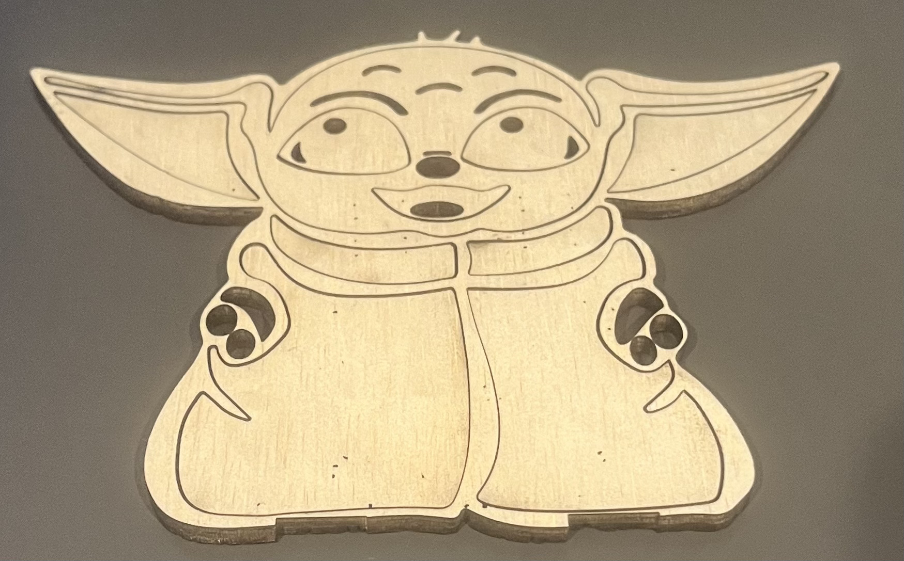

# Failures

During my first encounter with the laser cutting machine i ran into some issues whit the design i had chosen. The design i wanted to use was way too detailed and didn't create the type of casing that would be able to hold the embedded device. In my next iteration i will decrease the amount of detail in the design. However i have learned more about working with the laser cutter which means i will need less time next time working with the machine. 