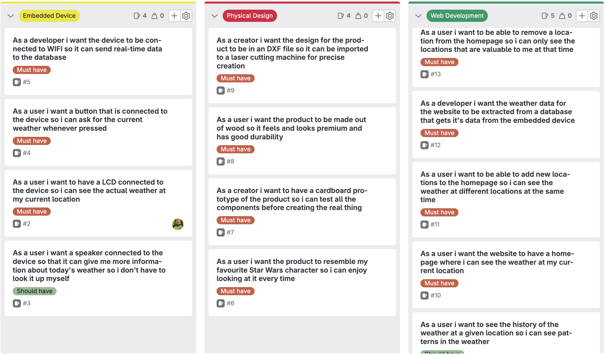

# Project Planning
On this page you will find the user stories and their corresponding topic and relevance. This will be a guideline for which components will have to be finished at the end of this period. Also a weekly planning is added that gives a more detailed look at which aspects i am going to be completing daily.

# User Stories

# Weekly Planning
| Week | Physical Design | Web Development | Embedded Device |
|---|---|---|---|
| 1 | First sketch of product | Creating homepage layout | Adding temperature sensor to device |
| 2 | Making first cardboard prototype | Creating database | Adding LCD screen to device |
| 3 | Creating SCAD for protoype | Retrieving data from database | Sending data to database |
| 4 | Creating first wooden prototype | Adding more functionalities to webapp | Adding button to device |
| 5 | Working on wooden prototype | Refactoring webapp | Adding speaker to device |
| 6 | Assembling wooden prototype | Adding could have functionalities | Refactoring |
| 7 | Market research | Market research | Market research |
| 8 | Time for could haves | Time for could haves | Time for could haves |
