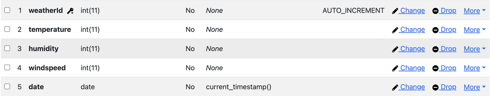

# Database

I have chosen to use two tables in my database. The Weather table represents the current weather measurement with the corresponding time and date and several temperature related values like: temperature, humidity and windspeed. Also an auto generated id is added to each reading. The Weather History table has a foreign key which is linked to the real-time temperature table, this way the weather history table doesn't have to store reduntant values. The tables have a one to many relationship because there can only be one current weather reading at a time, the weather history table however can have multiple readings.

I asked Mats for feedback on my initial UML diagram before i would make it in SQL Workbench. In the feedback i mainly got feedback on the use of the weather history table, this table was unnecessary due to the use of time in the regular weather table. By using SQL functions i will be able to sort and filter the weather as needed. Below is the updated version database in MySQL Workbench. In the below example i have removed the history table.

After making the database in MySqlWorkbench and inserting data into the database i realised there was still one issue with my database. I had used the DECIMAL(1) for the temperature column. This meant that only values with 1 digit could be inserted which is incorrect. When creating the final database design i changed the value of temperature from DECIMAL(1) to INT so it would be possible to add round temperature's as available in the API. Below you will find the final design for my database with a link to the insert script. The insert script creates the database: weather. Inside this database you will find a auto-generated id that is generated with each insert. The temperature, humidity and windspeed which are all integers. The date column is also auto-inserted, this will add the current date with each new insert.

