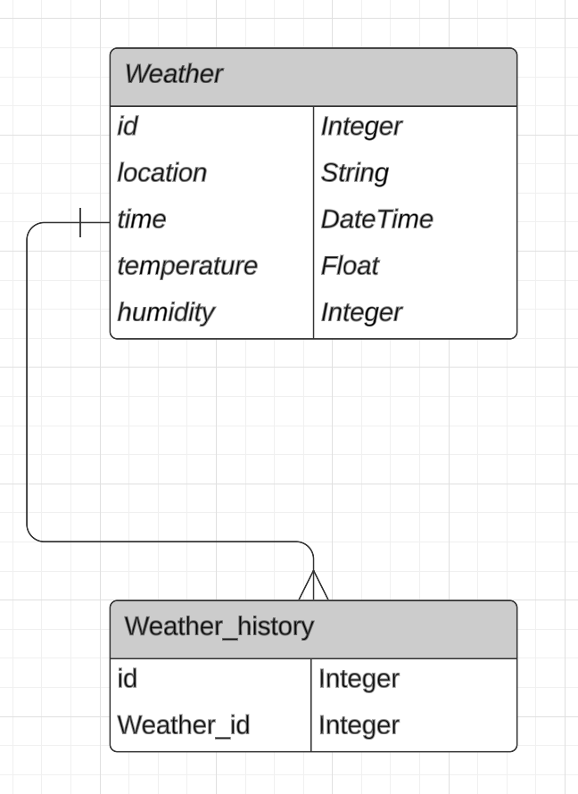
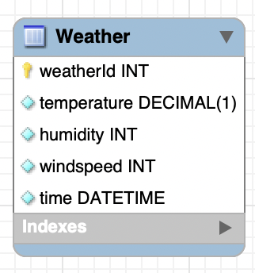

# Database

I have chosen to use two tables in my database. The Weather table represents the current weather measurement with the corresponding time and date and several temperature related values like: temperature, humidity and windspeed. Also an auto generated id is added to each reading. The Weather History table has a foreign key which is linked to the real-time temperature table, this way the weather history table doesn't have to store reduntant values. The tables have a one to many relationship because there can only be one current weather reading at a time, the weather history table however can have multiple readings.

I asked Mats for feedback on my initial UML diagram before i would make it in SQL Workbench. In the feedback i mainly got feedback on the use of the weather history table, this table was unnecessary due to the use of time in the regular weather table. By using SQL functions i will be able to sort and filter the weather as needed. Below is updated version the database in MySQL Workbench.

